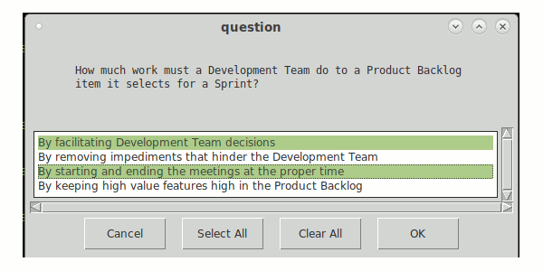

# Quiz Scrum multichoice in Python 3.



## What you need to make it work :
pygame and easygui at least version 0.98  
```sh
sudo python3 -m pip install --upgrade easygui
```
## Particularity
The questions are imported from a XML file.

## Developer - Author

Hamdy Abou El Anein

